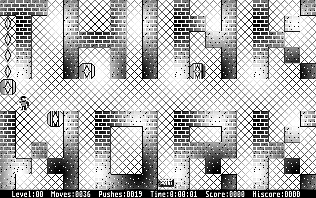
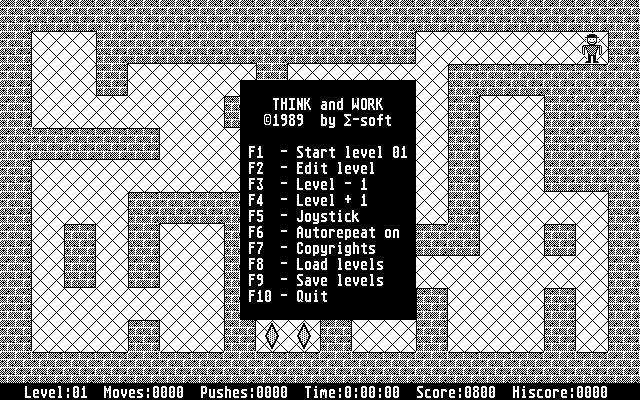
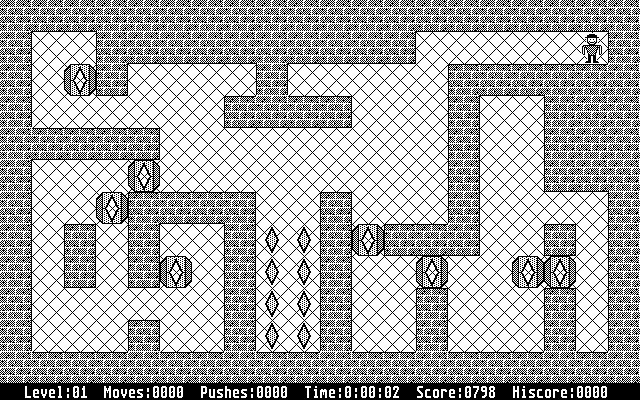

# Think & Work

A small game published in the Happy Computer magazine, written by Johann Schilcher for the Atari XL. I copied the levels and wrote the game from the scratch for the Atari ST. It was published with the source code together with the TurboAss.

  * [THNKWORK.ASM](THNKWORK.ASM) The 68k source code for the game
  * [LEVEL.DAT](LEVEL.DAT) The file with the levels
  * [THNKWORK.PIC](THNKWORK.PIC) Atari ST 640x400 b/w bitmap with the b/w images
  * [THNKWORK.PI2](THNKWORK.PI2) Atari ST 640x200 4 color bitmap with the color images

The image files can be opened with [GraphicConverter](http://www.graphicconverter.com).
